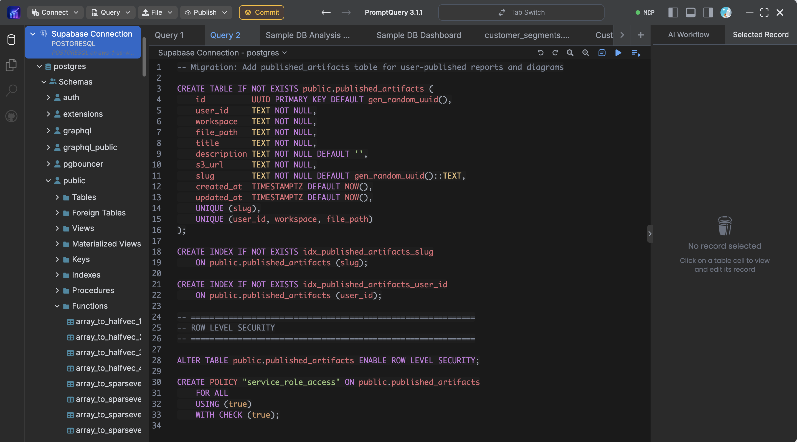
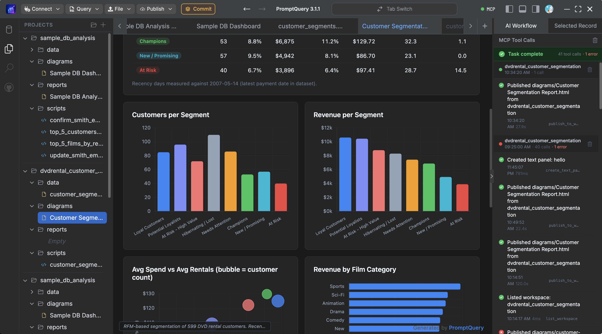
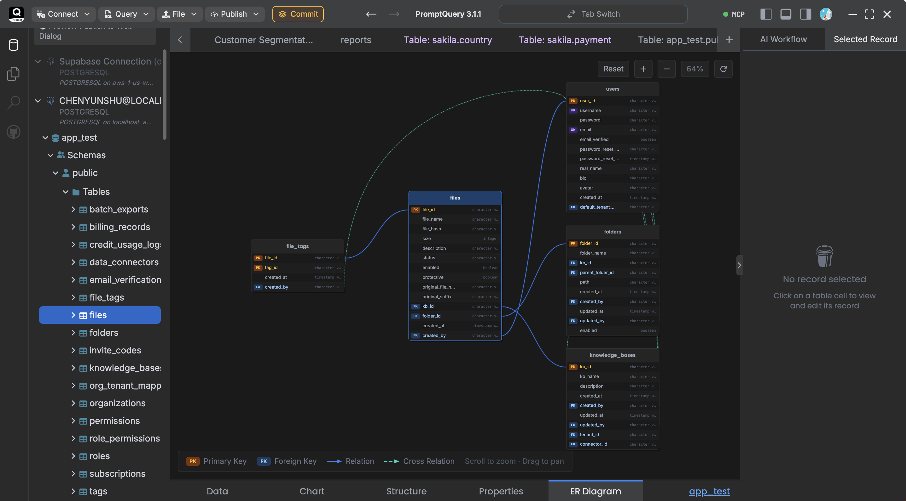
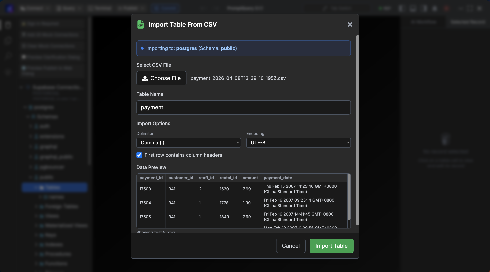
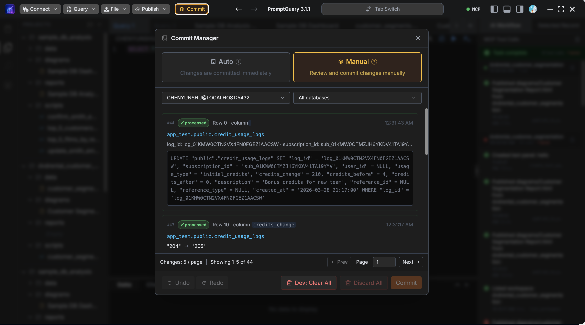

  

<h1 align="center">PromptQuery</h1>

  <strong>MCP-native database client for AI agents.</strong>

  Give Claude, Cursor, Codex, Windsurf, Github Copilot, Antigravity, OpenCode and other AI agents safe database access without losing control of production.

  <a href="#download">Download</a> ·
  <a href="#demo-video">Demo Video</a> ·
  <a href="#features">Features</a> ·
  <a href="#supported-databases">Supported Databases</a> ·

---

## What Is PromptQuery?

PromptQuery is a modern desktop database client built for the AI-agent era.

It lets you publish a database connection as a local MCP server so MCP-compatible tools and agents can query your database using natural language. Connections are read-only by default, and risky operations such as `DELETE`, `DROP`, and `UPDATE` require your explicit approval.

PromptQuery is designed for developers, database administrators, data analysts, and teams that want AI-assisted database workflows while keeping humans in control.

## Why PromptQuery?

Traditional database clients were built for humans writing queries by hand. PromptQuery is built for a new workflow where humans, AI agents, and databases work together safely.

With PromptQuery, you can connect SQL and NoSQL databases, expose them to MCP-compatible agents, generate reports from natural language, and keep sensitive operations behind explicit user approval.

PromptQuery helps teams move faster without handing agents unrestricted database access:

- **One client for SQL and NoSQL**: Work with PostgreSQL, MySQL, SQL Server, Oracle, SQLite, MariaDB, MongoDB, Redis, DynamoDB, Firebase, Supabase, and more from one interface.
- **MCP-native by design**: Publish database connections as MCP servers for Claude, Cursor, and other compatible AI tools.
- **Safe by default**: Let agents inspect, query, and reason over data while writes, deletes, and schema changes require approval.
- **Human-in-the-loop control**: Review generated SQL, commands, reports, and risky operations before they touch your database.
- **Built for real workflows**: Browse data, edit rows, generate reports, visualize schemas, import/export CSVs, and batch-commit changes.
- **Cross-platform desktop app**: Use the same workflow on macOS, Windows, and Linux.

## Demo Video

Watch the PromptQuery demo video:

  

.

## Features

### MCP Server, Built In

Publish any database connection as an MCP server so Claude, Cursor, and other MCP-compatible agents can query it directly.

### Read-Only by Default

Agents can inspect and query safely. Writes, deletes, and DDL operations are blocked until you grant permission for the connection.

### Agentic Workflows, Sandboxed

Let agents plan multi-step database workflows across SQL and NoSQL databases while keeping you in the loop.

### Natural-Language Reports

Turn a single prompt into runnable SQL, interactive charts, and shareable reports generated from your own databases.

  

### Unified Database Interface

Use one consistent interface across your databases for browsing schemas, running SQL, viewing results, editing rows, importing data, and exporting query results.

### ER Diagram

Understand your database structure instantly with interactive ER diagrams rendered directly from your live schema.

  

### CSV Import and Export

Import CSV files into database tables and export query results quickly without manual formatting work.

  

### Batch Commit

Make row-level inserts, updates, and deletes, review the full diff, and commit everything in one atomic operation.

  

## Supported Databases

PromptQuery supports both SQL and NoSQL databases from one desktop interface.

### SQL Databases

- PostgreSQL
- MySQL
- SQL Server
- Oracle
- SQLite
- MariaDB
- Supabase PostgreSQL

### NoSQL And Cloud Databases

- MongoDB
- MongoDB Atlas
- Redis
- DynamoDB
- Firebase

## Download

PromptQuery is available for:

- macOS
- Windows
- Linux

Use the links below to learn more or download PromptQuery:

- [Website](https://www.promptquery.app)
- [Download](https://www.promptquery.app/#download)
- [Documentation](https://www.promptquery.app/docs)

## Security Model

PromptQuery is designed around explicit user control:

- Database connections are managed locally by the desktop app.
- AI-agent access is read-only by default.
- Dangerous operations require user approval.
- Permission settings are configured per connection.
- Users can review generated SQL before execution.

PromptQuery helps teams use AI agents with databases without giving agents unrestricted production access.

## Public Roadmap

Planned areas of improvement include:

- More database integrations
- Better MCP-agent workflows
- Expanded report generation
- Team collaboration features
- More granular permission controls
- Improved import/export workflows
- Additional chart and visualization options

Have an idea? Open a feature request in GitHub Issues.

## Source Code

PromptQuery is currently distributed as a desktop application. This public repository is used for product information, issue tracking, feature requests, and community feedback.

The application source code is not included in this repository.

## Useful Links

- Website: https://www.promptquery.app
- Documentation: https://www.promptquery.app/docs
- Download: https://www.promptquery.app/#download
- Issues: https://github.com/PromptQuery/PromptQuery/issues
- Releases: https://github.com/PromptQuery/PromptQuery/releases

